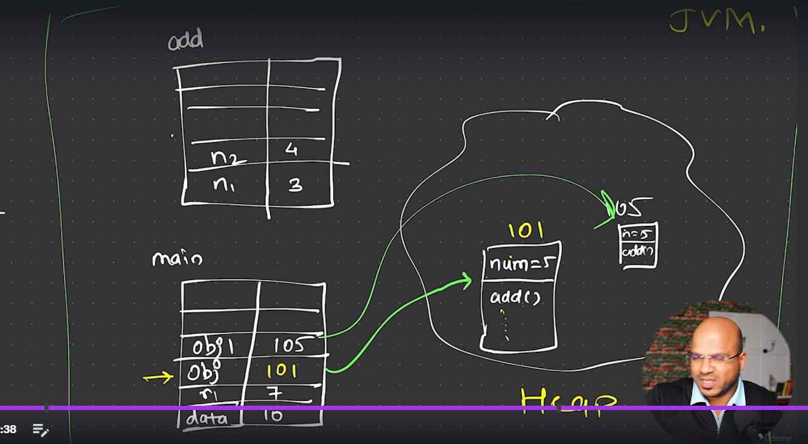

## JDK , JRE, JVM

### JDK - To compile the java code

- why we need a Java Development kit ?
- When we write a readable code we need to compile to byte code

### JVM - Which runs the code

    - Space where we run the byte code in java virtual machine
    - Makes java platform independent as we haad extra virtual layer
    - fina;;y we need JVM to run code

### JRE - Java Run Time Environment

    - Checks all the classes and imported libraries
    - Ultimately JVM is importsnt
    - any extra files that we need will provide by JRE

- JRE is the part of JVM
- Without JRE we dont have JVM
- JVM is inside JRE

- (1)JDK -> (2)JRE -> (3)JVM

- main -> it is a method when says the start of execution 
- Actual dev of any product or software we will create modules
-  All modules come together as software
-  in java we create components with classes

## Method Overloading in java
- We can have same method name , but different number of parameters
- Or same number of parameters but different types 
- Can have different return type

## Whats inside JVM ?
- Area  where we have a feature LAST IN FIRST OUT - Stack Memory
- Heap Memory - Open space 
- Every method has it own stack 
- Stack will have key and value which contains all the data and variables i.e., local variables
- In heap memory --> all the instance variables are stored inheap memory 
- In heap memory --> it will store the method definition 
- And the address of heap memory is stored in the stack 
- Every time we create OBJECT (which is refernce variable ) 

